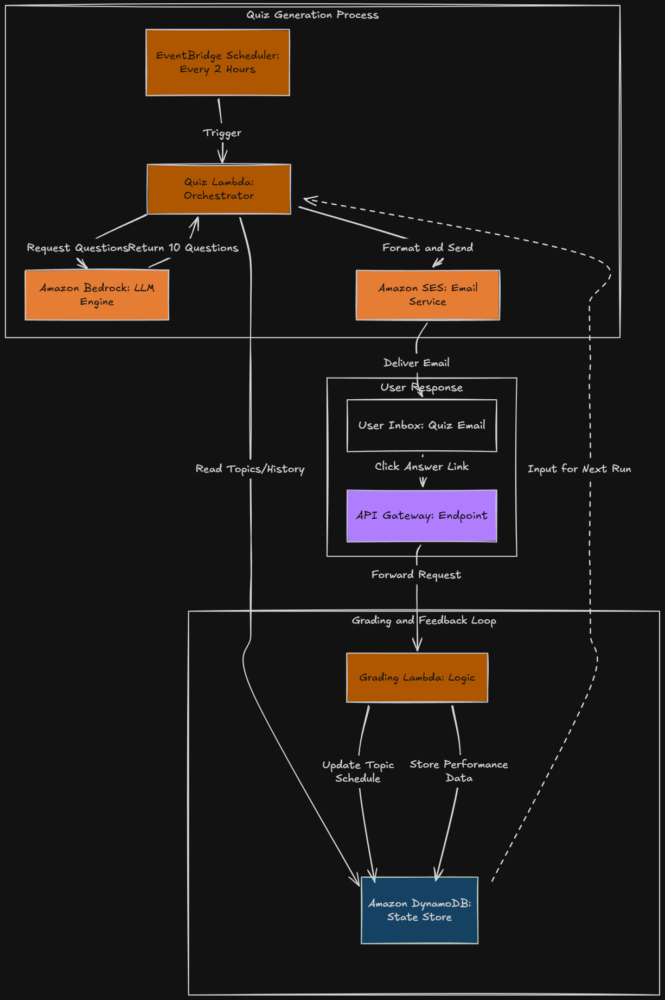
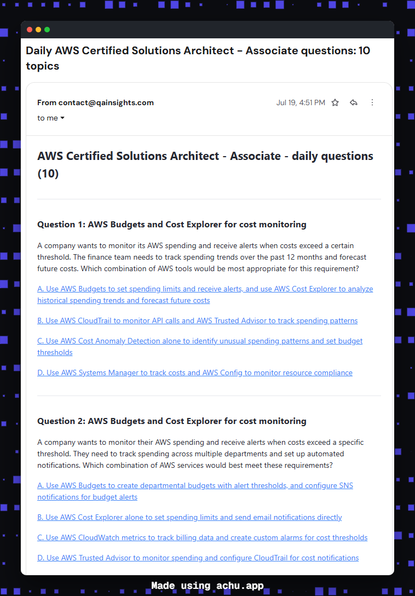
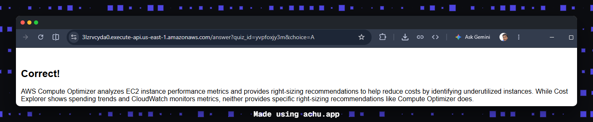
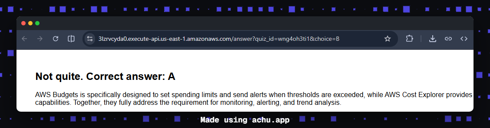
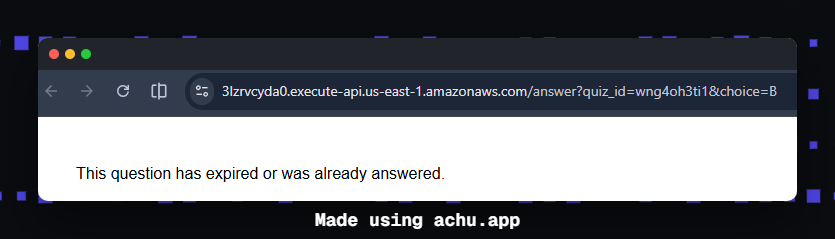
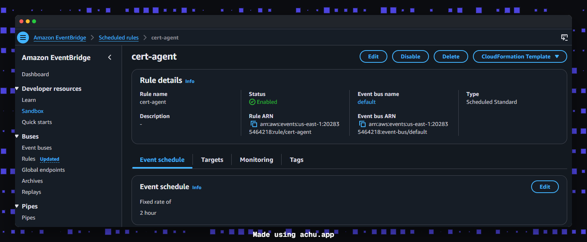
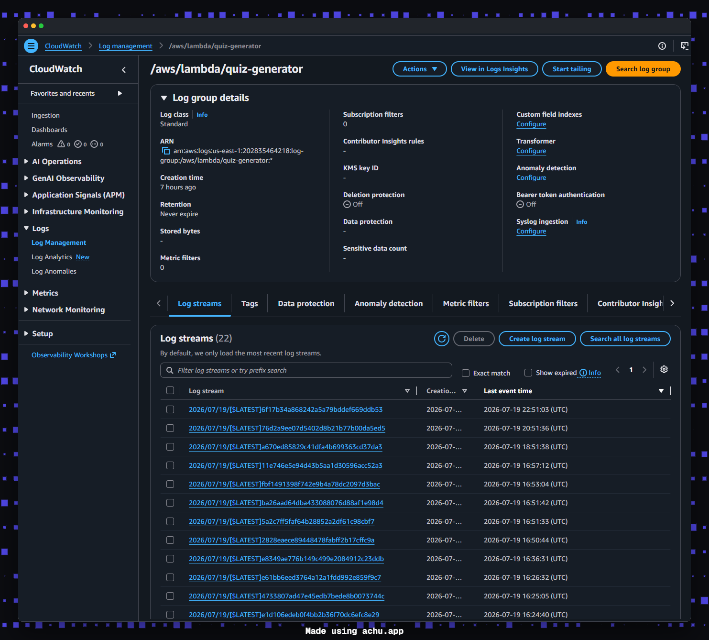
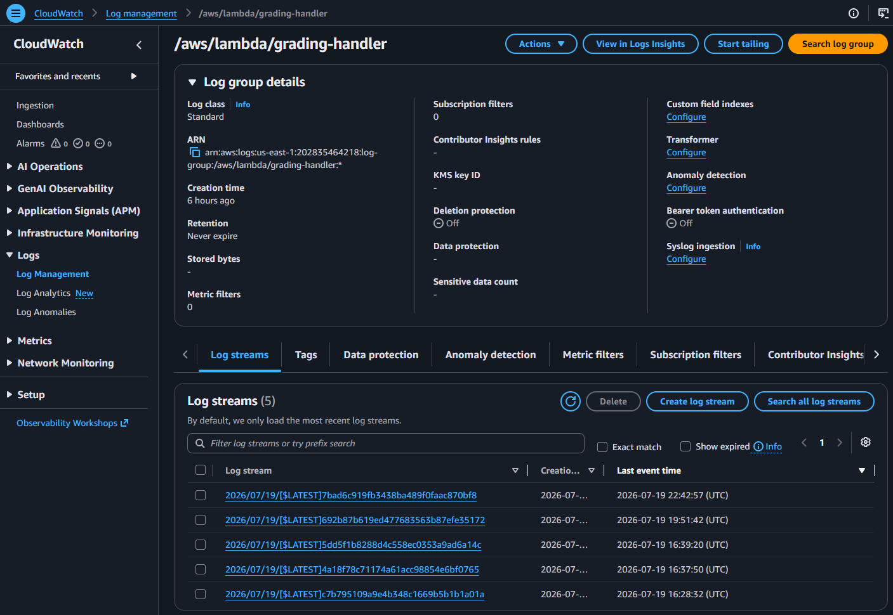

# Leitner Loop


An always-on agent that emails you up to ten fresh, AI-generated practice
questions every two hours for whichever AWS certification you're studying,
grades each answer when you click its link, and reschedules that topic
using a spaced repetition (Leitner) scheme. Switching certifications is a
one-line config change, no redeploy needed.

## Architecture



## Step 1: Enable Bedrock model access

In the Bedrock console, go to Model access and request access to the model
you want to use. Approval is usually instant for Anthropic Claude models.

The default `BEDROCK_MODEL_ID` is `us.anthropic.claude-haiku-4-5-20251001-v1:0`
(US cross-region inference profile for Claude Haiku 4.5 — the cheapest active
Anthropic model). Newer Claude models (4.x and above) cannot be invoked
directly by their base model ID; you must use a cross-region inference profile
ID prefixed with `us.` or `global.` instead. List available profiles with:

```bash
aws bedrock list-inference-profiles --region us-east-1 \
  --query 'inferenceProfileSummaries[?status==`ACTIVE`].{Id:inferenceProfileId,Name:inferenceProfileName}' \
  --output table
```

Older Claude 3.x and Claude 3.5 Sonnet model IDs are deprecated by AWS and
will fail with `ResourceNotFoundException: This model version has reached the
end of its life.` Do not use them.

## Step 2: Create the DynamoDB tables

- `cert-quiz-topics`: partition key `cert_code` (String), sort key `topic`
  (String)
- `cert-quiz-pending`: partition key `quiz_id` (String). Enable TTL on the
  `ttl` attribute so answered or expired questions clean themselves up.

Both on-demand billing mode, both stay within AWS Free Tier for this use.

## Step 3: Create the IAM roles

Create **two** IAM roles for Lambda (one per function) so each has its own
security boundary. Attach the basic Lambda execution policy (CloudWatch Logs)
to each, plus an inline DynamoDB policy.

The inline DynamoDB policy in `iam_policy.json` grants the actions both
functions need on both tables. Attach it to each role as an inline policy:

```bash
# For the quiz-generator role
aws iam put-role-policy \
  --role-name quiz-generator-role \
  --policy-name CertQuizDynamoDBPolicy \
  --policy-document file://iam_policy.json

# For the grading-handler role
aws iam put-role-policy \
  --role-name grading-handler-role \
  --policy-name CertQuizDynamoDBPolicy \
  --policy-document file://iam_policy.json
```

The `iam_policy.json` policy grants `dynamodb:GetItem`, `dynamodb:PutItem`,
`dynamodb:UpdateItem`, `dynamodb:DeleteItem`, and `dynamodb:Query` on
`cert-quiz-topics` and `cert-quiz-pending`. The quiz-generator additionally
needs `bedrock:InvokeModel` and `ses:SendEmail`/`ses:SendRawEmail` — those
are already in `iam_policy.json`.

> **Note on IAM propagation:** After attaching or changing a role's inline
> policy, an already-warm Lambda execution environment will keep using its
> cached STS session credentials for a while. To force a cold start that
> picks up the new policy immediately, update the function configuration
> (e.g. bump the timeout by 1 second) or just wait a few minutes.

## Step 4: Create the Lambda functions

Create two functions, Python 3.14 runtime, each using its own role from
step 3. **Set the quiz-generator timeout to 60 seconds** — it makes up to
10 sequential Bedrock calls (~3s each, ~30-35s total) plus DynamoDB writes.
Set the grading-handler timeout to 30 seconds.

```bash
aws lambda update-function-configuration --function-name quiz-generator --timeout 60
aws lambda update-function-configuration --function-name grading-handler --timeout 30
```

**quiz-generator**, code from `lambda_quiz_generator.py`, environment
variables:

| Variable | Example | Notes |
|---|---|---|
| TOPICS_TABLE | cert-quiz-topics | |
| PENDING_TABLE | cert-quiz-pending | |
| SENDER_EMAIL | you@example.com | must be a verified SES identity |
| RECIPIENT_EMAIL | you@example.com | must be a verified SES identity |
| API_BASE_URL | (fill in after step 6) | API Gateway invoke URL |
| BEDROCK_MODEL_ID | us.anthropic.claude-haiku-4-5-20251001-v1:0 | use a `us.` or `global.` inference profile ID, not a base model ID |
| QUESTIONS_PER_EMAIL | 10 | optional, defaults to 10; total questions generated per run |
| QUESTIONS_PER_TOPIC | 2 | optional, defaults to 2; questions generated per due topic |

The Lambda picks `ceil(QUESTIONS_PER_EMAIL / QUESTIONS_PER_TOPIC)` due
topics and generates `QUESTIONS_PER_TOPIC` questions for each, stopping
when it hits `QUESTIONS_PER_EMAIL`. If fewer topics are due than needed,
you get fewer questions (one batch per due topic).

**grading-handler**, code from `lambda_grading_handler.py`, environment
variables: `TOPICS_TABLE`, `PENDING_TABLE` (same values as above).

## Step 5: Verify SES identities

SES starts in sandbox mode, which is fine since you're only emailing
yourself. In the SES console, verify your sender address and your own inbox
as a recipient identity.

## Step 6: Create an API Gateway HTTP API

Create an HTTP API with one route, `GET /answer`, Lambda proxy integration
to `grading-handler`. Copy the invoke URL and set it as `API_BASE_URL` on
`quiz-generator` (step 4).

## Step 7: Create the EventBridge Scheduler rule

Create an EventBridge rule with your preferred schedule expression. The
default is `rate(2 hours)` — fires 12 times per day, each run sends up to
`QUESTIONS_PER_EMAIL` questions if topics are due. If no topics are due,
the Lambda exits without sending.

```bash
aws events put-rule --name cert-agent --schedule-expression "rate(2 hours)" --state ENABLED
```

Add the Lambda as a target with the cert code as input:

```bash
aws events put-targets --rule cert-agent \
  --targets '[{"Id":"1","Arn":"arn:aws:lambda:us-east-1:ACCOUNT:function:quiz-generator","Input":"{\"cert_code\": \"SAA-C03\"}"}]'
```

To switch certifications later, edit the input payload, nothing else
changes. To change frequency, edit the schedule expression (e.g.
`cron(0 12 * * ? *)` for once daily at 12:00 UTC).

> **Note:** The Lambda only sends an email when due topics exist. Answered
> topics are rescheduled 1+ days into the future by the Leitner system, so
> if you answer all questions in an email, subsequent runs will be silent
> until topics come due again.

## Step 8: Seed your topics

Run `seed_topics.py` locally with AWS credentials configured
(`python seed_topics.py SAA-C03`) to load the exam domains and topics for
your target certification into DynamoDB. SAA-C03 has 30 topics pre-seeded,
distributed across the 4 exam domains proportionally to their weightings
(9 Secure, 8 Resilient, 7 High-Performing, 6 Cost-Optimized). Other certs
have 4-5 topics each — expand them in `seed_topics.py` if you want broader
coverage.

To use a different cert, change the `cert_code` argument. Re-running the
seed script is safe — it uses `put_item` which upserts, but note that it
resets `box` to 1 and `next_due` to the past, so existing Leitner progress
on those topics is lost.

## Step 9: Test end to end

1. Manually invoke `quiz-generator` in the Lambda console with a test event
   `{"cert_code": "SAA-C03"}`.
2. Confirm the email arrives with up to `QUESTIONS_PER_EMAIL` questions
   (10 by default, 2 per due topic), each with its own four answer links.
3. Click an option on any question, confirm the grading page shows
   correct/incorrect and an explanation for that question.
4. Check DynamoDB, the answered topic's `next_due` and `box` should have
   updated. The other questions in the same email remain answerable until
   you click them or their 48-hour TTL expires.

## Screenshots

**Email with practice questions**  


**Grading confirmation pages**  
  
  


**EventBridge schedule**  


**CloudWatch logs**  
  


